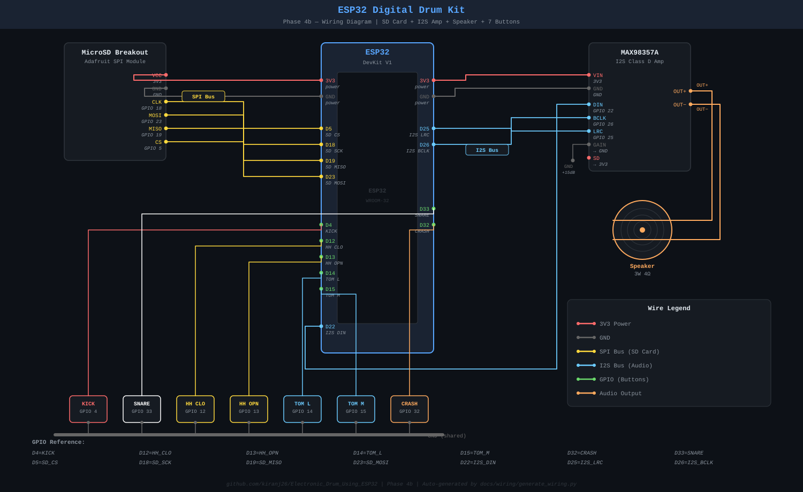

# ESP32 Digital Drum Kit

A progressive hardware + software drum machine built on the ESP32-M1 DevKit.  
Each phase adds capability — from a zero-hardware browser demo to a fully wireless instrument you play with physical buttons, no cables, no laptop.

---

## Project Phases

### Phase 0 — UART + Web Browser MVP ✅ Complete
**Branch:** `phase-0-mvp` | **Hardware:** ESP32 + USB cable only

ESP32 sends drum commands over USB Serial. Chrome web app listens via Web Serial API and plays sounds via Web Audio API. Proof of concept — zero extra hardware.

```
Serial Monitor → USB → Chrome Web Serial API → Web Audio API → laptop speakers
```

---

### Phase 1 — Physical Buttons → UART → Browser ✅ Complete
**Branch:** `phase-1-buttons` | **Hardware:** + 7 buttons + breadboard + jumper wires

7 tactile buttons wired to GPIO pins. Each press fires a hardware interrupt, debounces in 10ms, sends a drum command over USB to Chrome. First time it feels like a real instrument.

```
Button press → ESP32 ISR → Serial UART → Chrome → Web Audio API → laptop speakers
```

**GPIO map:** GPIO 4=KICK, 5=SNARE, 12=HIHAT_CLOSED, 13=HIHAT_OPEN, 14=TOM_LOW, 15=TOM_MID, 18=CRASH

#### Phase 1 Demo

https://github.com/user-attachments/assets/dd6a18f4-1137-4b9d-854d-ca3681d37620

---

### Phase 2 — WiFi AP + WebSocket → iPhone Audio ✅ Complete
**Branch:** `phase-2-wifi-ap` | **Hardware:** No new hardware needed

**The big leap — completely wireless. No USB cable. No laptop. No router.**

ESP32 creates its own WiFi hotspot. iPhone connects to it, opens Safari, loads the drum web app served directly from the ESP32's flash memory. Press a physical button → WebSocket message → iPhone speaker plays the drum sound.

```
Button press
      ↓
ESP32 GPIO ISR (10ms debounce)
      ↓
WebSocket broadcast over WiFi AP (192.168.4.1)
      ↓
iPhone Safari receives message
      ↓
Web Audio API resumes + plays drum sound on phone speaker
```

#### Phase 2 Demo

https://github.com/user-attachments/assets/d413f8be-6853-4fed-81b4-6168fe795195


#### How to Reproduce Phase 2

**What you need:**
- ESP32-M1 DevKit + USB cable (for flashing only)
- 7 buttons wired from Phase 1 (same wiring, unchanged)
- iPhone with Safari
- VS Code + PlatformIO installed
- Python 3 (comes with macOS)

---

**Step 1 — Clone the repo and switch to the phase branch**
```bash
git clone <repo-url>
cd Electronic_Drum_Using_ESP32
git checkout phase-2-wifi-ap
```

---

**Step 2 — Get drum WAV samples**

If you did Phase 1, your samples are already in `web_app/phase0/samples/`.  
If not, download 7 free WAV files from sampleswap.org → DRUMS (SINGLE HITS) and name them:
```
web_app/phase0/samples/kick.wav
web_app/phase0/samples/snare.wav
web_app/phase0/samples/hihat_closed.wav
web_app/phase0/samples/hihat_open.wav
web_app/phase0/samples/tom_low.wav
web_app/phase0/samples/tom_mid.wav
web_app/phase0/samples/crash.wav
```

---

**Step 3 — Bundle the web app**

Run from the repo root:
```bash
python3 web_app/phase2/bundle.py
```

You should see all 7 samples confirmed and output written to `firmware/phase2/data/index.html`.

---

**Step 4 — Open firmware/phase2 in VS Code**

```
File → Open Folder → firmware/phase2/
```

Wait for PlatformIO to finish loading (blue bar at bottom goes solid).

> If your ESP32 port is different from `/dev/cu.usbserial-3110`, update `upload_port` and `monitor_port` in `firmware/phase2/platformio.ini` to match your port. Run `ls /dev/cu.*` with ESP32 plugged in to find it.

---

**Step 5 — Upload the web app to ESP32 flash (SPIFFS)**
```
Cmd+Shift+P → PlatformIO: Upload Filesystem Image
```
Wait for `[SUCCESS]`.

---

**Step 6 — Flash the firmware**

Click the **→ Upload** button in the bottom blue bar.  
Wait for `[SUCCESS]`.

---

**Step 7 — Connect iPhone**

1. Unplug USB from laptop (ESP32 can run from any USB power source or power bank)
2. On iPhone → **Settings → WiFi**
3. Connect to **DrumKit-ESP32** (password: `drumkit123`)
4. Open **Safari** → go to `http://192.168.4.1`
5. Tap **"Tap to Start"**
6. Wait for the status dot to turn **green** (WebSocket connected)

---

**Step 8 — Play**

Press any physical button → hear drum sound on iPhone speaker.  
Tap pads on screen → also plays sound.

> **Tip:** If you don't hear sound after pressing buttons, press the **EN/RST** button on the ESP32 to reboot it, then refresh Safari. The phone needs a moment to establish the WebSocket connection after boot.

---

### Phase 3 — FreeRTOS Dual-Core Task Split ✅ Complete
**Branch:** `phase-3-polyphony` | **Hardware:** Same as Phase 2

FreeRTOS task split — WiFi/WebSocket on Core 0, button input on Core 1. Eliminates scheduling jitter between input detection and wireless broadcast. Button presses never wait for WiFi processing.

```
Core 0 — WiFiTask:  ws_server.loop() + http_server.handleClient()
Core 1 — InputTask: reads ISR flags → ws_server.broadcastTXT()
ISRs:               IRAM_ATTR, fire on any core, set volatile flags only
loop():             vTaskDelay(portMAX_DELAY)  ← permanently idle
```

#### Phase 3 Demo

<!-- TODO: Add Phase 3 demo video here -->

---

### Phase 4a — SD Card WAV Loading ✅ Complete
**Branch:** `phase-4a-sd-card` | **Hardware:** + Adafruit microSD card module (owned)

Mounts a microSD card over SPI at boot. All 8 WAV drum files validated (22050Hz 16-bit mono) and loaded into heap buffers. SNARE and CRASH remapped to GPIO 33/32 to free the SPI pins.

```
Boot → SPI → SD card → read 8 WAV files → validate → heap buffers → ready
```

#### Phase 4a Demo

<!-- TODO: Add Phase 4a demo video here -->

---

### Phase 4b — I2S Amp + Speaker Audio ✅ Complete
**Branch:** `phase-4b-i2s-audio` | **Hardware:** + MAX98357A I2S amp + Adafruit #3351 3W 4Ω speaker

Routes WAV buffers from Phase 4a through a MAX98357A Class D I2S amplifier to a physical speaker. Fully standalone — no phone, no laptop, no WiFi required.

```
Button press → ESP32 ISR → InputTask (Core 1) → AudioTask (Core 0) → I2S DMA → MAX98357A → speaker
```

**Key technical details:**
- 4-voice polyphonic mixer — simultaneous hits mix cleanly
- Two-pass WAV loader prevents heap fragmentation from SD I/O
- 0.5x software attenuation balances hardware +15dB amp gain
- 50ms debounce eliminates double-triggers on tactile buttons
- WAV samples: 22050Hz 16-bit mono, standard 44-byte header required

**I2S wiring:**
| MAX98357A | ESP32 |
|---|---|
| DIN | GPIO 22 |
| BCLK | GPIO 26 |
| LRC | GPIO 25 |
| GAIN | GND (+15dB) |
| VIN | 3V3 |

#### Phase 4b Demo

https://github.com/user-attachments/assets/b0563da3-9379-4325-9881-f0377f5ed5b3

---

### Phase 5 — OLED Display + Kit Switching
**Branch:** `phase-5-display` | **Hardware:** + 0.96" OLED (I2C)

Display current kit name and hit indicators. Toggle between Rock / Electronic / Jazz sample sets.

---

### Phase 6 — Enclosure + Final Build
**Branch:** `phase-6-enclosure` | **Hardware:** Full BOM

Physical enclosure, color-coded buttons, speaker grille, polished firmware. The finished instrument.

---

## Demo

### Phase 1 — Physical Buttons → USB → Browser

https://github.com/user-attachments/assets/dd6a18f4-1137-4b9d-854d-ca3681d37620

### Phase 2 — Physical Buttons → WiFi → iPhone

https://github.com/user-attachments/assets/d413f8be-6853-4fed-81b4-6168fe795195

### Phase 4 - Physical Buttons → Amplifier → Speaker

https://github.com/user-attachments/assets/164722a4-a0ad-4758-9e7e-273e6b227607


---

## Wiring Diagram — Phase 4b (current)



> **Regenerate:** `python3 docs/wiring/generate_wiring.py` — run this after each phase to update the diagram.

---

## Hardware BOM by Phase

| Component | Phase needed | Have it? | Est. Cost |
|-----------|-------------|----------|----------|
| ESP32-M1 DevKit | Phase 0 | ✅ | — |
| USB cable (data) | Phase 0 | ✅ | — |
| 7x tactile push buttons | Phase 1 | ✅ | ~$3 |
| Jumper wires | Phase 1 | ✅ | ~$2 |
| Breadboard | Phase 1 | ✅ | — |
| iPhone (any) | Phase 2 | ✅ | — |
| Adafruit microSD card breakout | Phase 4a | ✅ | ~$8 |
| MicroSD card (any size) | Phase 4a | ✅ | — |
| MAX98357A I2S amp module | Phase 4b | ✅ | ~$3 |
| Adafruit #3351 3W 4Ω speaker | Phase 4b | ✅ | ~$4 |
| OLED 0.96" I2C (Adafruit #4440) | Phase 5 | ✅ ordered | ~$4 |
| Project enclosure | Phase 6 | ❌ | ~$5–15 |
| **Phase 2 total** | | | **$0** |
| **Full build total** | | | **~$28–40** |

---

## Repository Structure

```
Electronic_Drum_Using_ESP32/
├── CLAUDE.md                    ← Claude Code pair programming context
├── README.md                    ← This file
├── GETTING_STARTED.md           ← Phase 0 step-by-step setup guide
├── docs/
│   ├── system_requirements.md   ← Full hardware + firmware spec
│   └── project_context.md       ← Phase decisions and context
├── firmware/
│   ├── phase0/                  ← UART command echo sketch
│   ├── phase1/                  ← Button ISR + UART
│   ├── phase2/                  ← WiFi AP + WebSocket + SPIFFS
│   ├── phase3/                  ← FreeRTOS dual-core (WiFi=Core0, Input=Core1)
│   ├── phase4a/                 ← SD card WAV loading + validation
│   └── phase4b/                 ← I2S amp + speaker audio (standalone)
│       └── audio_samples_original/  ← Source WAV files for re-conversion
└── web_app/
    ├── phase0/                  ← Chrome Web Serial + Web Audio app
    └── phase2/                  ← iPhone web app template + bundle script
```

---

## Development Log

| Phase | Status | Branch |
|-------|--------|--------|
| Phase 0 — UART + Browser MVP | ✅ Complete | `phase-0-mvp` |
| Phase 1 — Physical Buttons | ✅ Complete | `phase-1-buttons` |
| Phase 2 — WiFi AP + iPhone Audio | ✅ Complete | `phase-2-wifi-ap` |
| Phase 3 — FreeRTOS Dual-Core Split | ✅ Complete | `phase-3-polyphony` |
| Phase 4a — SD Card WAV Loading | ✅ Complete | `phase-4a-sd-card` |
| Phase 4b — I2S Amp + Speaker Audio | ✅ Complete | `phase-4b-i2s-audio` |
| Phase 5 — OLED + Kit Switch | Not started | `phase-5-display` |
| Phase 6 — Enclosure | Not started | `phase-6-enclosure` |
